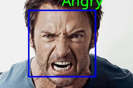

<h1 align="center">
FACIAL EMOTION DETECTION
</h1>

  <a href="#introduction">Introduction</a> •
  <a href="#key-features">Key Features</a> •
  <a href="#tech-stack">Tech Stack</a> •
  <a href="#snapshots">Snapshots</a>

## Introduction
Facial Emotion Detector checks whether a face is present in the image if yes then it will be displayed to which class that face belongs to and if no face is found then "No face found" will be displayed.

## Key Features
- Training Dataset -> Fer2013
- Works with both images and web cam
- Classifies emotion to 7 different classes

## Tech Stack
- Python
- OpenCV
- CNN

## Snapshots
 

